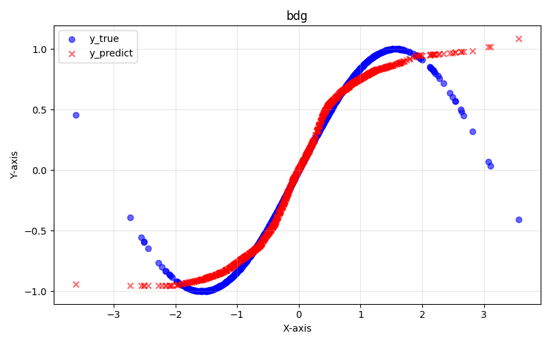
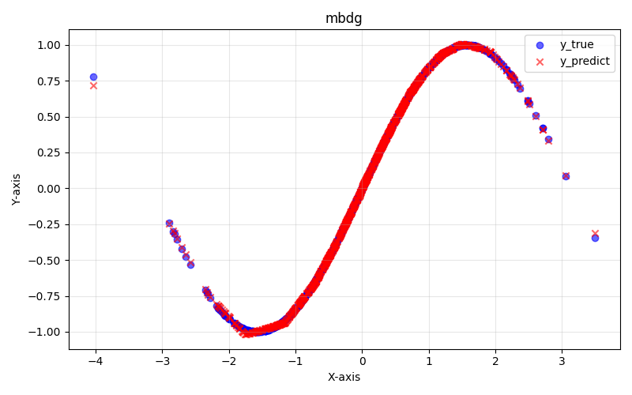
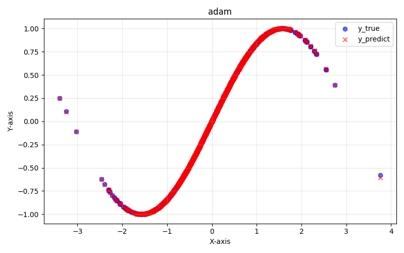

# My Neural Networks

A from-scratch neural network in pure NumPy — no frameworks, all math hand-written.

## What it does

- A single hidden layer MLP (input -> 64 hidden units with leaky ReLU -> scalar output) for regression
- Backpropagation derived and implemented by hand (closed form)
- Trained and tested on a synthetic dataset: `y = sin(x)`

## Features

- **Activations**: ReLU, Leaky ReLU, Sigmoid, Tanh (with derivatives)
- **Losses**: MSE, MAE (with derivatives)
- **Weight init**: He initialization
- **Optimizers**: Batch Gradient Descent (BGD), Mini-batch GD (MBGD), Adam with bias correction

## Results

Fitting `y = sin(x)` with different optimizers:

| BGD | MBGD | Adam |
|-----|------|------|
|  |  |  |

Adam converges the fastest and fits the curve almost perfectly.

## Usage

```bash
pip install numpy matplotlib
python main.py
```

You can switch between `bgd`, `mbgd`, and `adam_mbgd` in `main.py` (uncomment the one you want to run).

## Project Structure

| File | Description |
|------|-------------|
| `basicFunction.py` | Activations, losses, weight init |
| `trainingFunction.py` | Training loops: BGD, MBGD, Adam |
| `main.py` | Generates data, trains, evaluates, and plots results |
